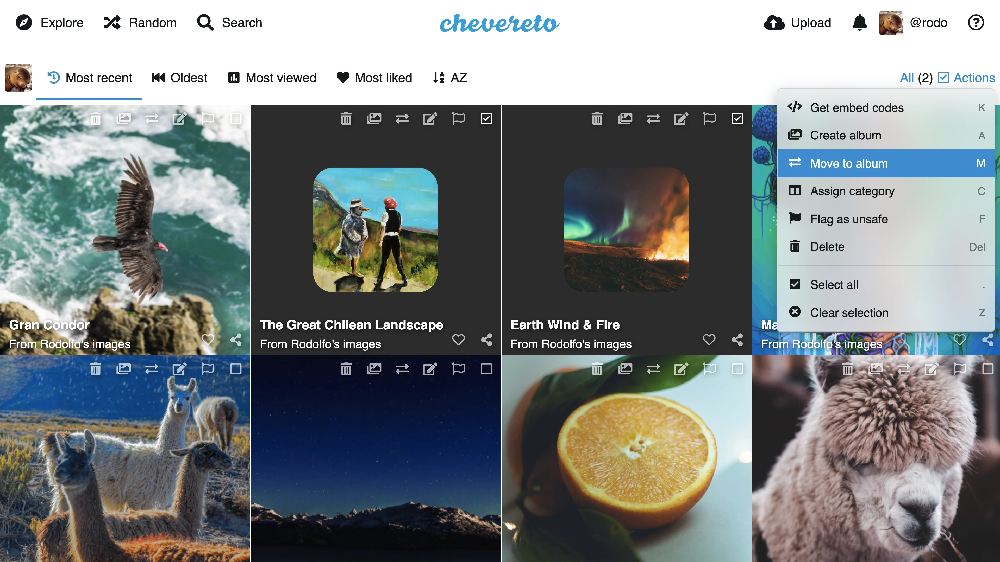

# Chevereto V4 Docs

[Chevereto](https://chevereto.com) is a robust, self-hosted media-sharing platform that prioritizes flexibility and control. It enables you to build and manage a media-sharing website on your own server, granting you complete autonomy over your hosting environment and policies. With Chevereto, you eliminate the risk of platform restrictions and shutdowns, ensuring your site operates entirely on your terms.

## Install

Review our [Installation docs](./application/installing/installation.md) for all alternatives. Chevereto runs anywhere, system requirements are minimal and it can run on any server.

## Updating

Follow the [Updating guide](application/installing/updating.md) to keep your Chevereto V4 system updated.

## Upgrading

For Chevereto V3 users:

* Follow the [Upgrading guide](application/installing/upgrading.md) to upgrade to Chevereto V4.
* Check the [Welcome back](introduction/changelog/welcome-back.md#chevereto-v4-vs-v3) reference.

## Troubleshooting

Got a `Something went wrong` message? Don't panic and check our [Troubleshooting](application/reference/errors.md#something-went-wrong) guide.

## Support

Go to [chevereto.com/support](https://chevereto.com/support).
