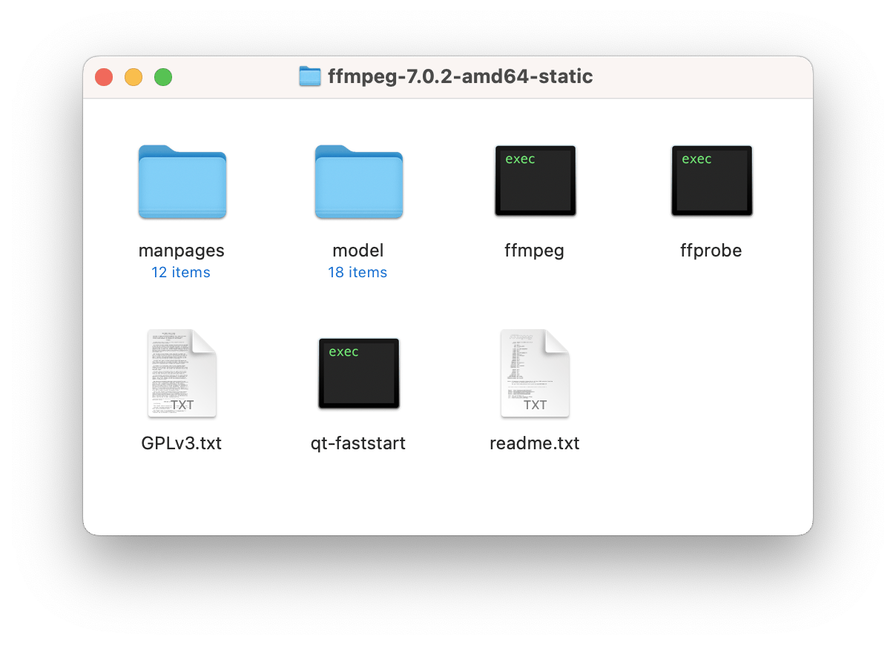

# Operating system

Chevereto V4 is made for Unix-like systems and it is CI tested against [Ubuntu](https://ubuntu.com/) `ubuntu-latest`.

V4 documentation at this time is written for **Debian-based** systems. We **recommend** checking/contributing with system-specific commands.

## Non Debian-based

Non Debian-based systems should work fine with Chevereto V4 long as the system stack packages matches with the versions available on Debian.

Make sure to replace references in this documentation from **www-data** to the target web-server user.

## Windows and others

For non Unix-like systems as Windows we **recommend** using our [Docker](../../guides/docker/README.md) provisioning.

## Video processing

Chevereto since V4.1 (Pulento) optionally requires [FFmpeg](https://ffmpeg.org) and FFprobe to process video uploads.

The FFmpeg binary should be available at the system path, alternatively you can configure the [binary location](../configuration/environment.md#binary-paths) manually.

If you can't install packages or if you are using a shared hosting, you can get the FFmpeg binary for your system from the [official website](https://ffmpeg.org/download.html) and upload it to your server.

