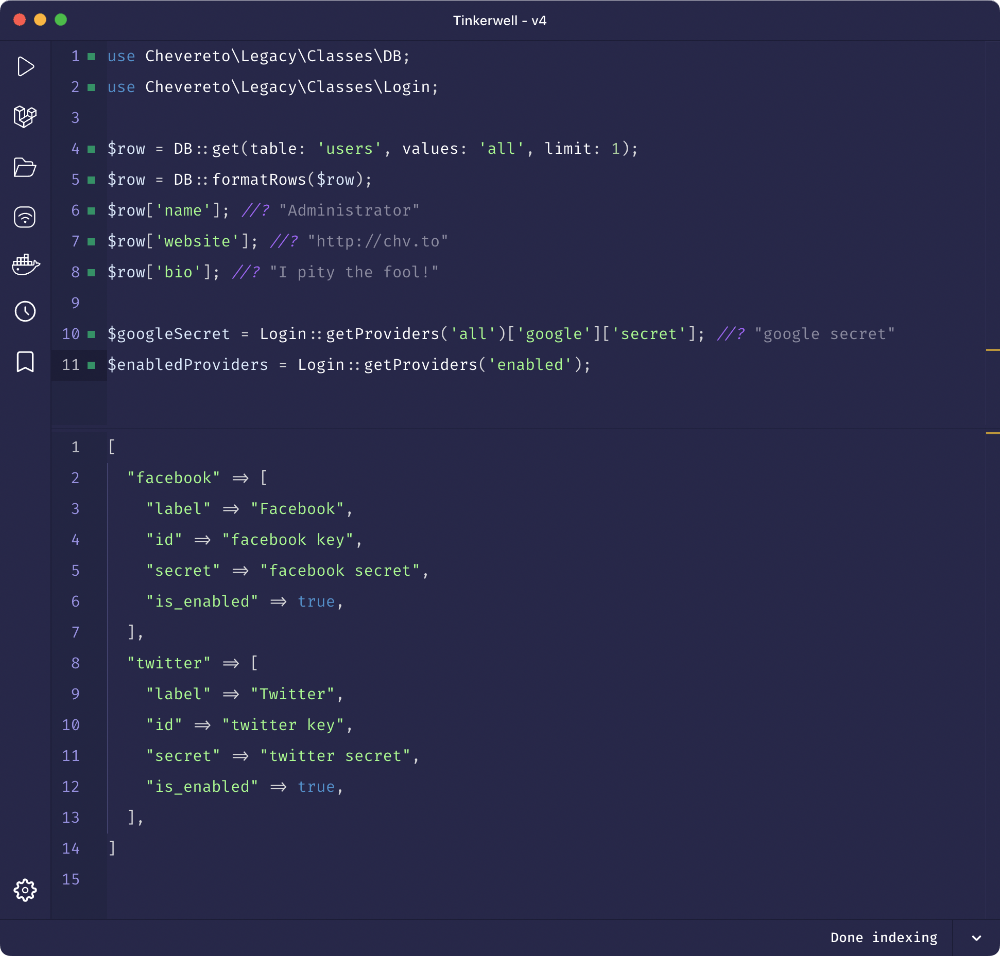

# 💫 REPL

Chevereto supports [Tinkewell](https://tinkerwell.app/) and [PsySH](https://psysh.org/), enabling to execute any set of instructions under the environment of a [read–eval–print loop](https://en.wikipedia.org/wiki/Read%E2%80%93eval%E2%80%93print_loop) (REPL).

You can interact directly with the Chevereto application as it enables to query the database, call any function within the public API, debug and to facilitate [exploratory programming](https://en.wikipedia.org/wiki/Exploratory_programming).



::: details Sample code
```php
use Chevereto\Legacy\Classes\DB;
use Chevereto\Legacy\Classes\Login;

$row = DB::get(table: 'users', values: 'all', limit: 1);
$row = DB::formatRows($row);
$row['name']; //?
$row['website']; //?
$row['bio']; //?

$googleSecret = Login::getProviders('all')['google']['secret']; //?
$enabledProviders = Login::getProviders('enabled');
```
:::

## Using Tinkerwell

To use Tinkerwell with Chevereto configure the PHP binary and open/connect your Chevereto installation.

## Using PsySH

PsySH comes included with Chevereto V4, run the following command to start the REPL environment.

```sh
app/bin/repl
```
