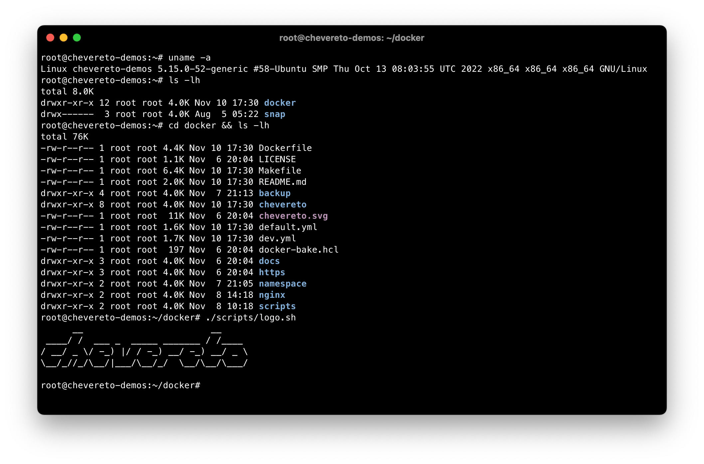
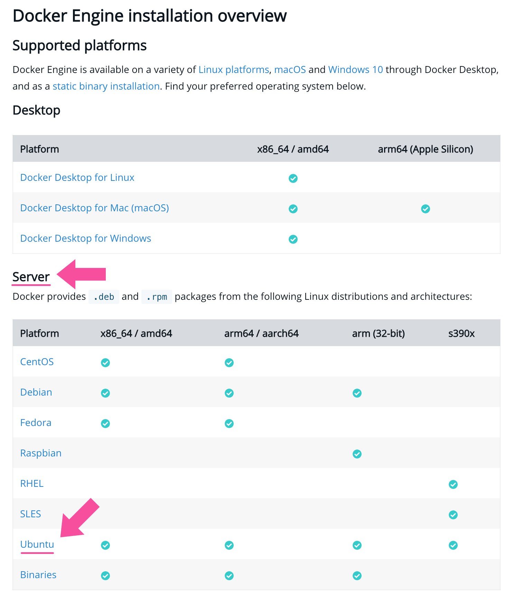

# 🐋 Docker

::: tip
This is the **best way** to deploy Chevereto.
:::

Docker refers to container technology, in this context you don't need to worry about PHP versioning, missing extensions, virtual host configuration, database server, anything. This is the best way to deploy Chevereto as the software infrastructure is provided by us.

## Advantages

This deploy alternative provides several advantages, to name a few:

* 🤹 Multiple website instances
* 📱 Portability
* 🌈 Easy maintenance
* 🔐 Automatic HTTPS setup
* 🎨 Customization
* 👮‍♂️ More secure
* 🌎 CloudFlare integration

## Repository

Check the repository at [chevereto/docker](https://github.com/chevereto/docker) for instructions.

## Requirements

* Chevereto license (for paid edition)
  * [Purchase](https://chevereto.com/pricing) new license
  * [Access](https://chevereto.com/panel/license) existing purchase
* Server with
  * Shell access
  * `make`, `unzip`, `curl` and `git`
* Hostname pointing to server
* See [CloudFlare](https://github.com/chevereto/docker/blob/4.0/docs/CLOUDFLARE.md) to setup automatic DNS integration

## Getting a server

For this guide we are referring to a server as a machine where you can [install Docker](https://docs.docker.com/engine/install/). In this server you will install Chevereto and expose it to the internet. You can use any computer, even at your home or from any cloud provider.

For this guide we will use a Ubuntu server in the cloud.

You may purchase a server from our partners ([Linode](https://chv.to/linode), [Vultr](https://chv.to/vultr)) including free credits.

## Shell access

The shell is a command-line interface that interprets user commands on the server. To access to the server shell you need a terminal emulator software. Don't feel intimidated, is not that hard as it looks as cloud provider may supply a web-based terminal software.

We recommend accessing your server shell with terminal software installed in your computer.

Here are some free, commonly-used terminal emulators by operating system:

| System  | Software                     |
| ------- | ---------------------------- |
| macOS   | Terminal, iTerm 2            |
| Windows | Windows Terminal, Putty      |
| Linux   | Gnome Terminal, Tilix, XTerm |



Once you get shell access, make sure that your server has `make`, `unzip`, `curl` and `git` installed. You will require to install these utilities if missing.

```sh
which make unzip curl git
```

## Cloning chevereto/docker

Get a copy of our base Docker project by cloning the repository in the server using `git`. This will create a `docker` folder in the current working directory.

```sh
git clone https://github.com/chevereto/docker.git
```

Go to this newly created `docker` folder.

```sh
cd docker
```

While on `docker` folder you can work with our Docker base project.

## Installing Docker

If you are using **Ubuntu** you can install docker by running:

```sh
make install-docker
```

For other systems follow the instructions for [Docker Engine installation](https://docs.docker.com/engine/install/). Make sure to check at **Server** for your specific Linux distribution.

::: details Docker Engine installation

:::

## Setup Cron

This process creates a Cron file at `/etc/cron.d/chevereto` that will run background jobs for all Chevereto instances in the server.

```sh
make cron
```

## Create proxy

This process creates the proxy service that handles incoming web traffic to the server. It will also provide automatic secure certificate for HTTPS.

```sh
make proxy EMAIL_HTTPS=mail@yourdomain.tld
```

At `EMAIL_HTTPS` option pass your email, required for HTTPS certificate notifications.

## Build Chevereto image

This process builds the container image for the Chevereto application.

💡 Omit this step when using free edition as the image is available at [GHCR](https://github.com/chevereto/chevereto/pkgs/container/chevereto).

```sh
make image
```

## Setup namespace

Create a [namespace](https://github.com/chevereto/docker/blob/4.0/docs/NAMESPACE.md) for each one of the Chevereto instances you want to deploy.

To create the `example` namespace for `img.chevereto.dev` hostname:

```sh
make namespace NAMESPACE=example HOSTNAME=img.chevereto.dev
```

## Spawn Chevereto instance

To create an instance run `make spawn` command by passing the NAMESPACE option.

💡 When using free edition pass `EDITION=free`.

```sh
make spawn NAMESPACE=example
```

🎉 Congratulations, Chevereto is now up an running.

To create more instances repeat the steps from [Setup namespace](#setup-namespace) for each additional website you want to spawn.
