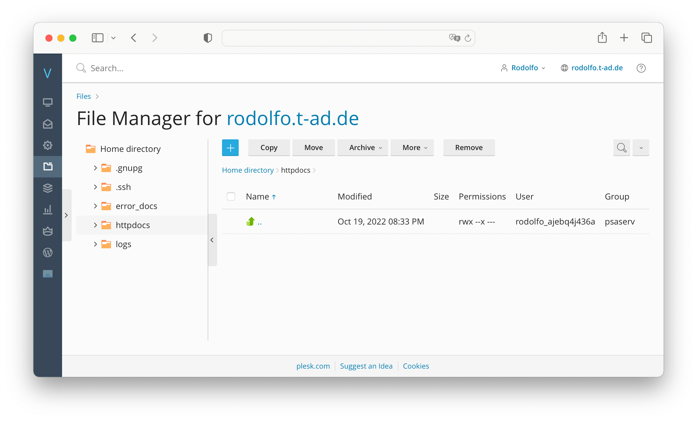
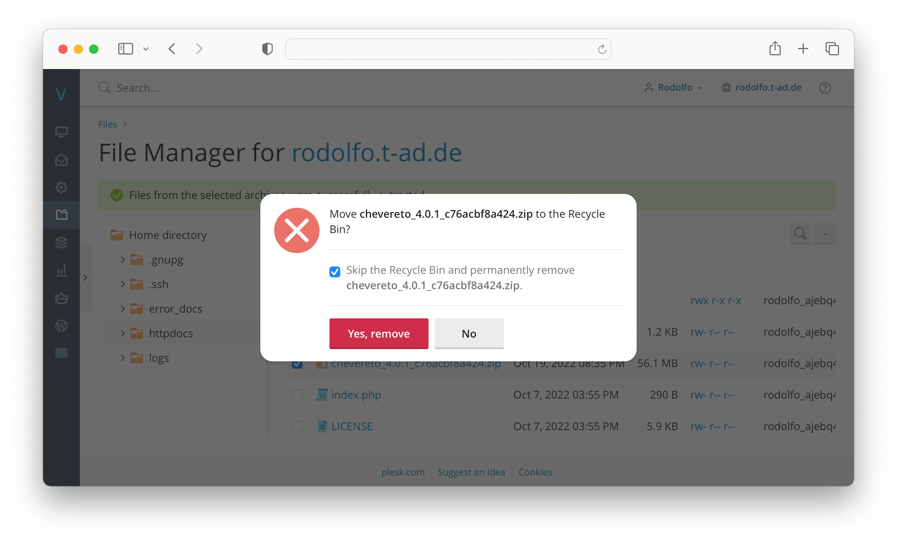

# Plesk App files

## Installing Chevereto

To install Chevereto on Plesk you need to use the release package and Plesk's file manager to unzip this package in your target website.

* Go to **File Manager** under **Your website**

* Navigate to your home `/home/httpdocs/` directory

* Click on the **Plus button** and select **Upload File**
* Upload the release zip file that you downloaded following [using release package](../../application/installing/installation.md#using-release-package) instructions
* **Click** on the uploaded zip file file and select **Extract**

* A prompt appears to confirm the zip extraction
* Select **Replace existing files** and click on **OK**
* Once done, remove the zip file

* If you are installing Chevereto for the first time you can continue with [Setup](../../application/installing/installation.md#setup).

## Updating Chevereto

To update Chevereto on Plesk simply follow the steps described above. That process only alters the application files, it won't touch the website contents.

If you made modifications to the software you may want to review these changes before.
