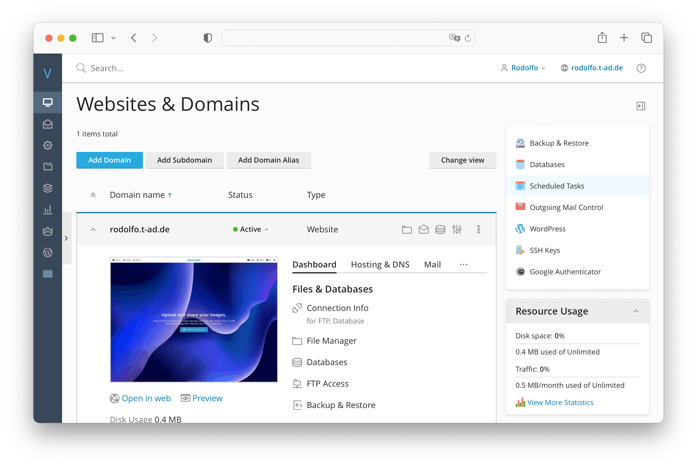
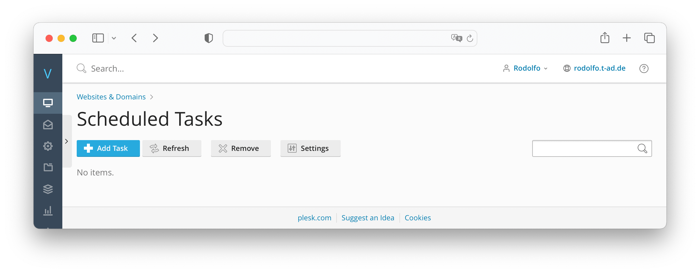
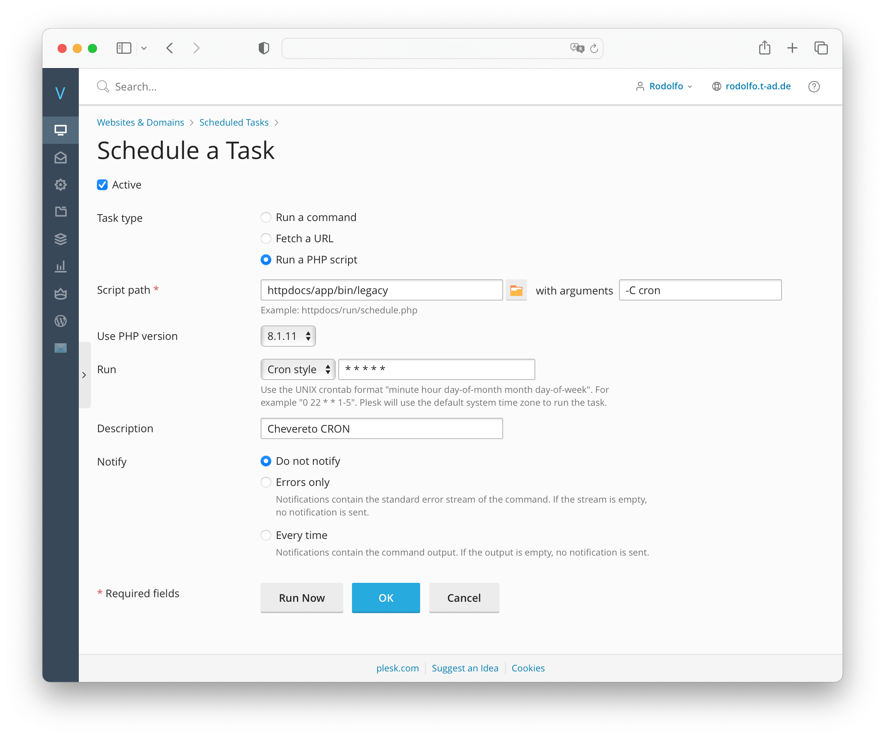
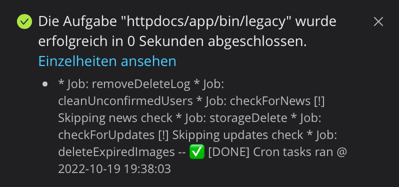

# Plesk CRON

## Add new CRON job

* Go to **Scheduled Tasks** under **Dev Tools**

* Click on **Add Task**

* Select **Run a PHP script** under **Task type**
* Use `httpdocs/app/bin/legacy` under **Script path**
* Set `-C cron` under **With arguments**
* Select PHP `8` under **Use PHP version**
* Select **Cron style** under **Run** and enter `* * * * *`
* Select **Do not notify** under **Notify**

* Click on **Run Now** and make sure that the command works

* Click **OK** to finish adding the CRON
