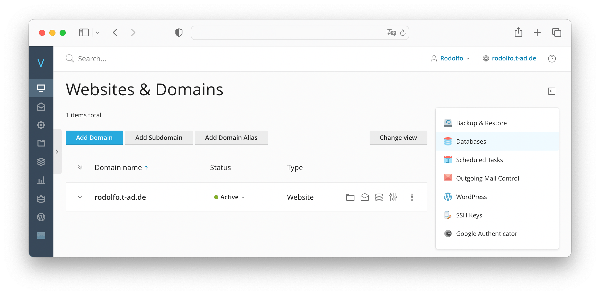
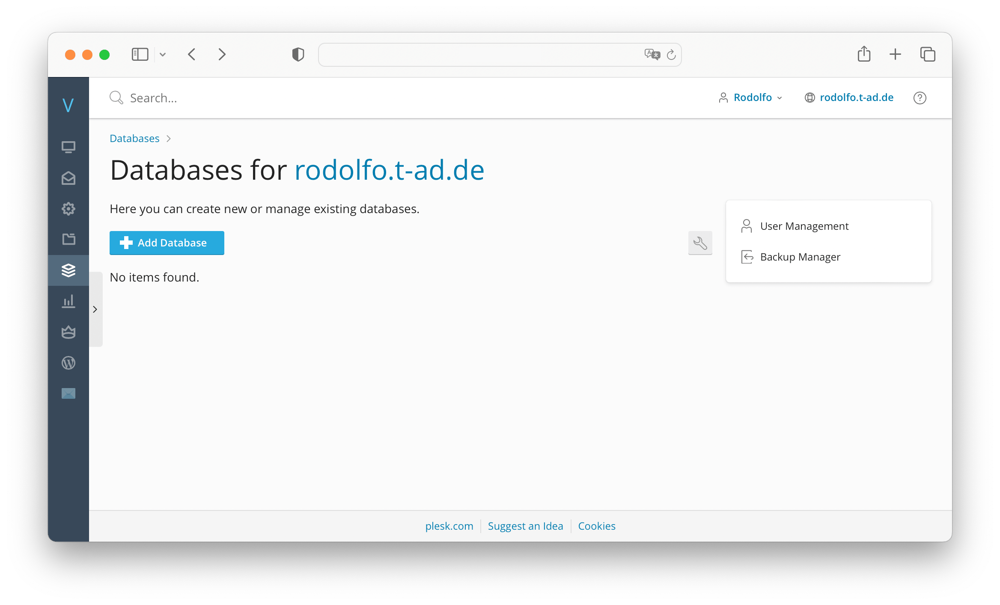
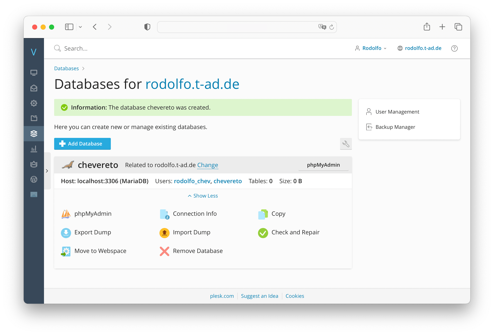

# Plesk Database

## Creating a database

* Go to **Databases**

* Click on **Add Database** and follow the process to create a database and its user. Make sure to relate this database to your website.

* Take note on the MySQL **database name**, **username** and **password**.

